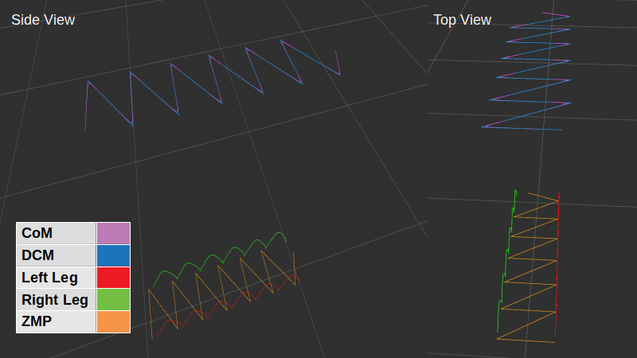

# README
Linear Inverted Pendulum Model (LIPM) Motion Planning for Humanoid/Bipedal legged robots. The code is open-source (BSD License). Please note that this work is an on-going research and thus some parts are not fully developed yet. Furthermore, the code will be subject to changes in the future which could include greater re-factoring.

# Getting Started
These instructions will get you a copy of the project up and running on your local machine for development and testing purposes.

## Prerequisites
* Ubuntu 16.04 and later
* ROS kinetic and later
* Eigen 3.2.0 and later

## Installing
* git clone https://github.com/mrsp/lipm_msgs.git
* git clone https://github.com/mrsp/lipm_motion.git
* catkin_make -DCMAKE_BUILD_TYPE=Release 
* If you are using catkin tools run: catkin build  --cmake-args -DCMAKE_BUILD_TYPE=Release 

## ROS Examples
### Launch on your Robot 
* Specify topics on config/planning_params.yaml
* roslaunch lipm_motion lipm_motion.launch

### Example Motion Plan for the Atlas humanoid robot
* roslaunch lipm_motion lipm_motion_atlas.launch

## Citation
Upon usage in an academic work kindly cite:    
  @INPROCEEDINGS{PiperakisIROS14,  
  author={S. {Piperakis} and E. {Orfanoudakis} and  M.G. {Lagoudakis}},  
  booktitle={2014 IEEE/RSJ International Conference on Intelligent Robots and Systems},   
  title={{Predictive Control for Dynamic Locomotion of Real Humanoid Robots}},  
  year={2014},  
  volume={},  
  number={},  
  pages={4036-4043},  
  doi={10.1109/IROS.2014.6943130}},  
  month ={Sept},  
} 

## License
[BSD](LICENSE) 
